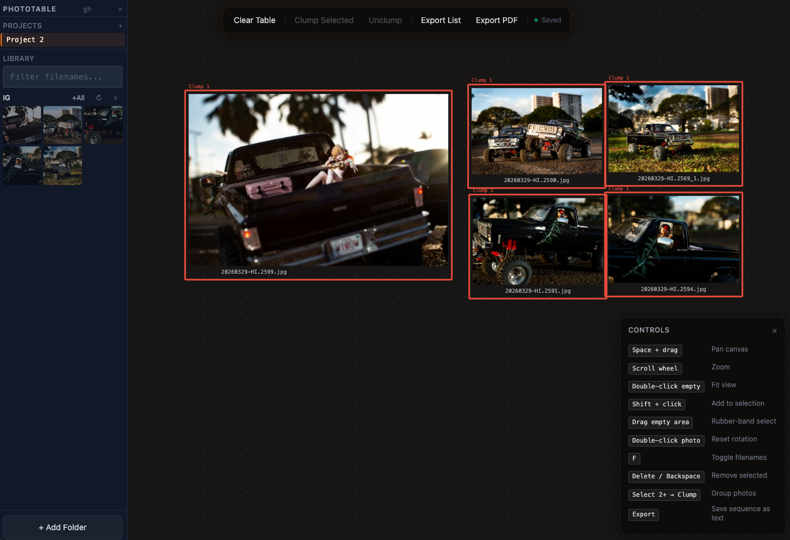

# PhotoTable

A digital light table for photographers, editors, designers, and anyone who wants to work through images spatially.

Drag photos onto an infinite canvas, arrange them into sequences, group related shots, recover missing sources, and export your edit order or whole project backup. It runs in the browser, on your machine. Nothing is uploaded anywhere.



---

## What it's for

- Sequencing a photo story or editorial
- Roughing out a layout or mood board
- Sorting selects before sending to a client
- Anything you'd normally do by spreading prints on a table

## Getting started

1. Open the app in Chrome (or any Chromium browser)
2. Click **+ Add Folder** in the sidebar and pick a folder of JPEGs
3. Drag photos onto the canvas
4. Arrange, resize, group, align, and sequence
5. Export a text list, PDF layout, or PhotoTable backup when you're done

> Chrome or Edge get the best folder-handle experience. Firefox works through folder import, but it cannot keep persistent folder handles in the same way.

## Features

**Canvas**
- Infinite pan and zoom
- Visible zoom controls, fit-all, and 1:1 reset
- Drag photos from the sidebar to place them
- Drag photos directly from Finder / Explorer onto the canvas
- Resize from any corner
- Rotate freely — double-click a photo to snap back to straight
- Rubber-band select multiple photos at once
- Two-finger pan/zoom support on touch screens
- Undo/redo for layout edits

**Grouping**
- Select 2 or more photos → **Clump** to link them into a color-coded group
- Clumped photos move together and are labeled in the export
- Rename clumps from the controls panel
- Selected clumps show a shared bounding box and count

**Projects**
- Create multiple projects and switch between them
- Each project saves automatically
- Save status shows when the table is saved, saving, or in an error state
- Project switching flushes pending saves before loading another project
- Imported and dropped image blobs can persist through reloads

**Export**
- **Text** — a plain list of filenames in sequence, organized by clump. Paste it into Capture One, Lightroom, or send it to a client
- **PDF** — a contact-sheet style layout of the current canvas
- **PhotoTable backup** — JSON backup for the active project, including embedded imported/dropped images when available

**Recovery and organization**
- Inspector panel for selected photo metadata and missing-source status
- Relink missing photos by filename after re-adding a folder
- Sidebar thumbnail density controls
- Folder image counts and placed-image markers
- Align selected photos left/top/center
- Distribute selected photos horizontally or vertically
- Match selected photo sizes

## Controls

| | |
|---|---|
| Pan | Middle-mouse drag · Space + drag |
| Zoom | Scroll wheel · toolbar `+` / `-` · two-finger pinch |
| Reset view | Double-click empty space · toolbar `1:1` |
| Fit all | Toolbar `Fit` |
| Add to selection | Shift + click |
| Select area | Drag on empty space |
| Resize photo | Drag any corner handle |
| Rotate reset | Double-click photo |
| Toggle filenames | `F` |
| Delete selected | `Delete` / `Backspace` |
| Undo | `Ctrl/Cmd + Z` |
| Redo | `Ctrl/Cmd + Y` or `Ctrl/Cmd + Shift + Z` |

### Toolbar labels

Some toolbar buttons use short labels so the controls stay compact:

| Button | Meaning |
|---|---|
| `L` | Align selected photos to the same left edge |
| `T` | Align selected photos to the same top edge |
| `CX` | Align selected photos by horizontal center |
| `CY` | Align selected photos by vertical center |
| `DX` | Distribute 3 or more selected photos evenly left-to-right |
| `DY` | Distribute 3 or more selected photos evenly top-to-bottom |
| `Size` | Match selected photo sizes to the first selected photo |
| `Names` | Show or hide filename labels |
| `TXT` | Export the edit order as a text file |
| `PDF` | Export the current layout as a PDF |
| `Save` | Export a PhotoTable backup |
| `Load` | Import a PhotoTable backup |

### Inspector

The inspector is a status panel for the selected photo. It is mostly there to answer: what file is this, where did it come from, and can PhotoTable still find the source image?

Use it when:

- A placed photo looks disconnected from its source file
- You need to confirm the filename or folder for a selected photo
- You want to see whether a photo is part of a clump/group
- You re-add a folder and want missing photos to relink by filename

The inspector is not a full editing panel yet. Most layout editing still happens directly on the canvas and toolbar.

## Recent work

The app has moved from prototype light table toward a safer editing tool:

- Added per-project autosave with visible save-error handling
- Added persistent local storage for imported/dropped image blobs
- Added object URL cleanup to reduce memory leaks
- Added undo/redo history with gesture-aware drag/resize commits
- Added backup export/import for active projects
- Added image dimension metadata for better layout math
- Added relinking for missing sources by filename
- Added inspector, alignment, distribution, match-size, zoom, and fit controls
- Added touch pan/zoom support
- Added guarded startup restore with visible warnings for missing folder permissions or bad image sources
- Added backup/import validation before saved project data is restored
- Added linting, smoke-test scaffolding, and a deploy helper
- Added batched sidebar thumbnail rendering for large folders
- Expanded tests around store history, relinking, and group delete behavior

Current verification:

```bash
npm run lint      # ESLint
npm test          # 50 tests
npm run build     # TypeScript + production Vite build
npm run check     # lint + tests + build
npm run test:e2e  # Playwright smoke test, requires Chromium host libraries
```

## Known limitations

- Folder handles depend on browser support; Chrome and Edge are the primary targets
- Firefox imports folders but cannot preserve folder handles the same way Chromium browsers can
- Backup import/export is project-focused, not a full multi-project workspace archive yet
- Relinking currently matches by filename first; stronger matching is planned
- Very large libraries are not virtualized yet
- The app stores data locally in the browser, so important projects should be backed up explicitly

## Roadmap

Near-term:

- Replace browser `confirm` / `prompt` dialogs with in-app modals
- Add a dedicated project manager view for rename, duplicate, archive, import, and export
- Improve relinking with stronger matching: folder path, file size, modified time, and optional manual selection
- Add richer keyboard shortcuts for alignment, distribution, zoom, and project switching
- Add Playwright smoke tests for drag/drop, project switching, backup import, and persistence

Later:

- Virtualize large sidebar libraries
- Add canvas viewport culling for very large boards
- Add project-level library manifests so folder moves are easier to recover from
- Add optional metadata display for EXIF/capture time/rating where available
- Add layout presets: grid, contact sheet, rows, stacks, and story sequence lanes
- Add collaborative/export formats for handoff to editing tools

## Finish-finish plan

The path from usable alpha to reliable local-first editing tool:

**Phase 1: Product hardening**
- Replace browser `confirm` / `prompt` dialogs with in-app modals (**in progress: clear table, delete project, rename clump, project manager rename/delete**)
- Add a project manager for duplicate, rename, delete, import/export, and active-project status (**in progress: manager, duplicate, rename, delete, active export**)
- Add explicit backup/recovery flows on first launch and before destructive actions (**in progress: first-launch backup nudge**)
- Add stronger relink UI with missing files, candidate matches, and manual reassignment
- Add empty, loading, and error states for projects, folders, imports, exports, and PDF generation (**in progress: backup import/PDF error surfacing**)

**Phase 2: Interaction polish**
- Refine the toolbar into grouped tool clusters with icons and tooltips
- Add a keyboard shortcut map and command palette
- Add a right-click/context menu for selected photos
- Add rotate handles or keyboard rotation nudges
- Add snap/grid options, align/distribute polish, and multi-select transform behavior
- Improve touch UX with larger handles and gesture testing

**Phase 3: Scale and performance**
- Virtualize sidebar thumbnails
- Cull offscreen canvas photo rendering
- Throttle expensive selection and bounding-box calculations
- Cache image metadata and thumbnails more deliberately
- Add IndexedDB cleanup and storage usage reporting
- Stress test with 1k, 5k, and 10k images

**Phase 4: Data safety**
- Add versioned project schema migrations
- Add project backup import validation
- Add automatic periodic backup prompts or local backup snapshots
- Add corruption recovery for IndexedDB records
- Add safer delete flows with undo support and project trash/archive

**Phase 5: Testing**
- Add Playwright smoke tests for app load, import, drag/drop, reload persistence, project switching, undo/redo, backup import/export, and relinking
- Add visual regression screenshots for toolbar, sidebar, inspector, and canvas
- Add performance tests for large libraries
- Add a manual QA checklist for Chrome, Edge, Firefox, desktop, and touch

**Phase 6: Packaging and deployment**
- Decide target: hosted static app, local Docker app, PWA, or desktop wrapper
- Add PWA manifest and offline behavior if staying browser-first
- Add Docker build/deploy docs if staying self-hosted
- Add release checklist and changelog
- Add version display in app

**Phase 7: Documentation**
- Add screenshots or short GIFs for core workflows
- Add a "How data is stored" section
- Add a backup/recovery guide
- Add browser support notes
- Add known limitations

Execution priority: Phase 1 first, then Phase 5 smoke tests, then Phase 3 performance. That makes the app dependable before expanding the surface area.

## Run locally

```bash
npm install
npm run dev
```

Then open `http://localhost:5173`.

## Deploy

```bash
npm run deploy
```

This builds the app, copies `dist/` to `/srv/www/phototable`, and restarts `web-landing` when the `docker` command is available.

---

Vibe-coded with [Claude Code](https://claude.ai/code).
